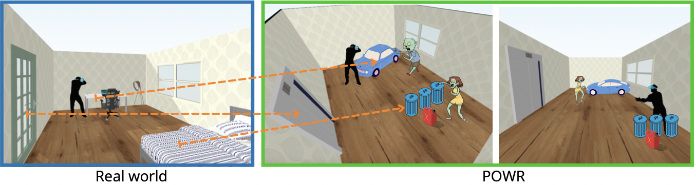
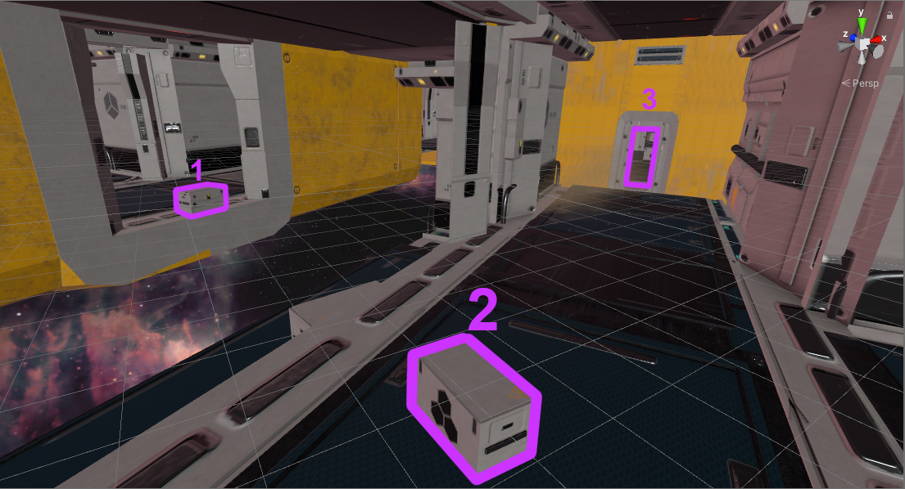

# Prop-Oriented World Rotation - an experimental VR technique

The associated academic paper for this project has now been published! Please read [here](https://link.springer.com/article/10.1007/s11042-024-18200-4)

_Submitted for the MSc in Computer Science at the University of Kent (Received 78% - Distinction)_

"POWR" is an experimental technique to enable games to map objects from the user's physical environment to objects in the virtual world. For example, the user's bed in their room reinforces a crate in the virtual world. This allows the users to benefit from haptic feedback from the virtual world without needing any bespoke prop or device.

[Demonstration video available here](https://drive.google.com/file/d/1llbX8GMii7S4EqpMPPW60bimOU-F97p7/view?usp=sharing)

 
 

The game is a simple shooter where you shoot all the robots to advance to the next checkpoint. Each checkpoint has a virtual object the player uses for cover, scaled and mapped to a physical object in the user's room. The crate object is mapped to the bed, and any door object in the game is mapped to the room door. This allows the player to intuitively lean on/ use the physical objects, resulting in fewer collisions with objects around their room.
